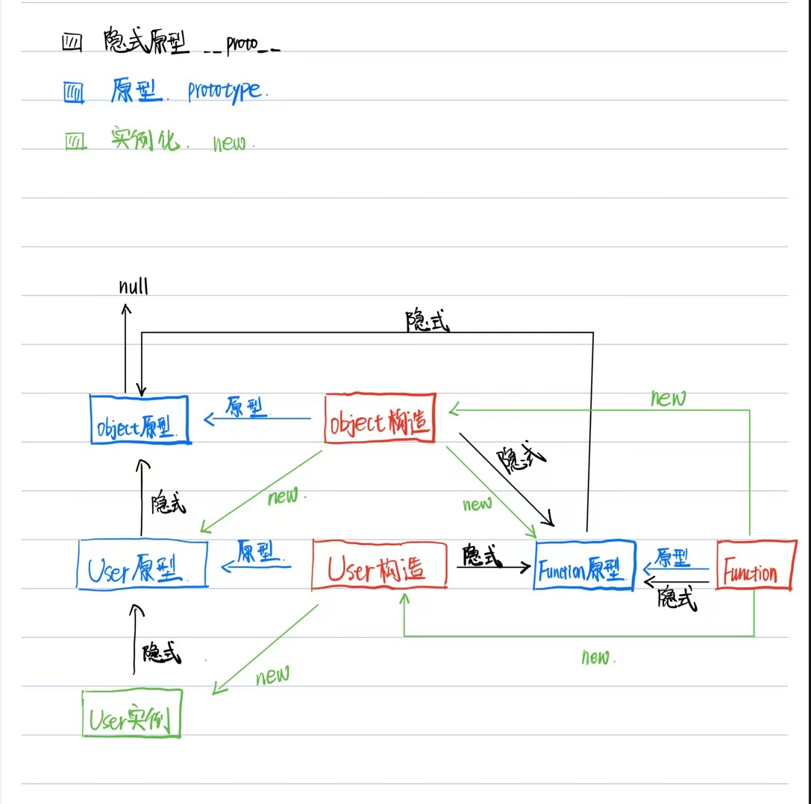
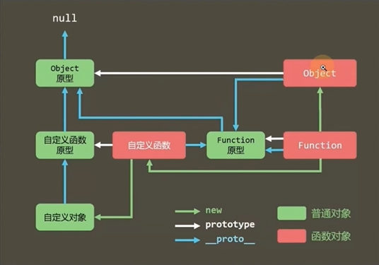

# 原型链

## 原型链图
::: tip
```js
// 下面的代码均验证了与图结构的一致性
function Vue() {

}
let vue = new Vue();
/** 对象才有隐式原型 */
// (1)实例对象的隐式原型指向构造函数对象的原型
console.log(vue.__proto__ === Vue.prototype)     // true
// (2) 普通函数是Function构造函数的实例对象
console.log(Vue instanceof Function)            // true
// (3)构造函数的原型是Object构造函数的实例对象
console.log(Vue.prototype instanceof Object)    // true
// (4)构造函数对象(底层通过Function构造函数创造出来的)的隐式原型指向Function原型
console.log(Vue.__proto__ === Function.prototype)   // true
// (5)Function构造函数对象的隐式原型指向Function原型
console.log(Function.__proto__ === Function.prototype)  // true
// (6)Function原型的隐式原型指向Object原型
console.log(Function.prototype.__proto__ === Object.prototype)  // true
// (7)实例对象vue的构造器constructor是构造函数(构造器可以被更改!!!)
console.log(vue.constructor === Vue);   // true
function Vue3() {
    this.name = 'vue3'
}
vue.constructor = Vue3;
console.log(vue.constructor);       // Vue3
console.log(vue.constructor === Vue);  // false
```

:::




