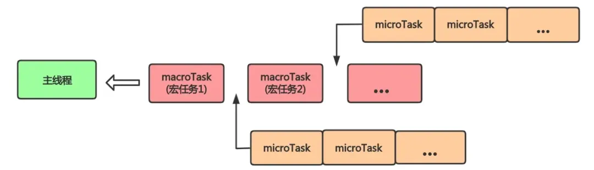
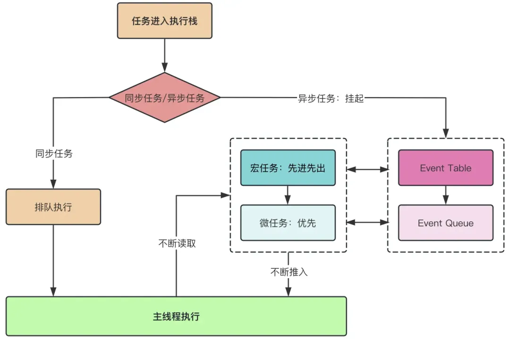
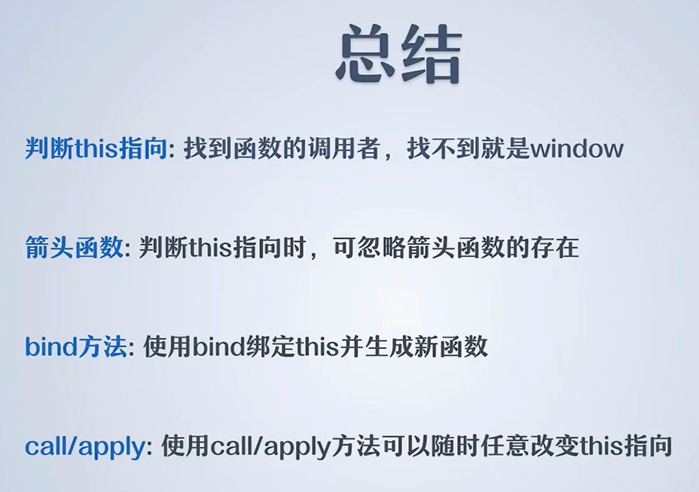

# JS 高级核心概念


## 事件循环原理

::: tip
> JavaScript作为一门**单线程语言**，必须要理解和掌握事件循环（Event Loop）和任务队列（Task Queue）的机制，高效地处理异步任务，保证用户体验的流畅性。

:::

### 事件循环概述

::: info
> 在事件循环中，当主线程执行完当前的同步任务后，会检查事件队列中是否有待处理的事件。如果有，主线程会取出事件并执行对应的回调函数。这个循环的过程被称为**事件循环**（Event Loop），它由**主线程**和**任务队列**两部分组成。**主线程负责执行同步任务**，而**异步任务则通过任务队列进行处理**。这种机制保证了异步任务在适当的时机能够插入执行，从而实现了JavaScript的`非阻塞异步执行`。

:::



事件循环流程如下：

> 1. 主线程读取JavaScript代码，形成相应的堆和执行栈。
> 2. 当主线程遇到异步任务时，将其委托给对应的异步进程（如Web API）处理。
> 3. 异步任务完成后，将相应的回调函数推入任务队列。
> 4. 主线程执行完同步任务后，检查任务队列，如果有任务，则按照先进先出的原则将任务推入主线程执行。
> 5. 重复执行以上步骤，形成事件循环。

### 同步任务
::: info
> 同步任务是按照代码的书写顺序一步一步执行的任务。当主线程执行同步任务时，会阻塞后续的代码执行，直到当前任务执行完成。典型的同步任务包括函数调用、变量赋值、算术运算等。例如：

:::


```js
console.log('Step 1');
let result = add(2, 3);
console.log(result);
console.log('Step 2');

function add(a, b) {
  return a + b;
}

```

在上面的例子中，`console.log('Step 1')` 执行完毕后才会执行函数调用 `add(2, 3)`，并等待 `add` 函数返回结果后才会继续执行后续代码。


### 异步任务
::: info
&nbsp;&nbsp;&nbsp;&nbsp;&nbsp;&nbsp;&nbsp;&nbsp;异步任务是在主线程执行的同时，通过回调函数或其他机制委托给其他线程或事件来处理的任务。在执行异步任务时，主线程不会等待任务完成，而是继续执行后续代码。包括：
> 
> - 回调函数 `callback`
> - `Promise/async await`
> - `Generator`
> - 事件监听
> - 发布/订阅
> - 计时器
> - `requestAnimationFrame`
> - `MutationObserver`
> - `process.nextTick`
> - `I/O`操作
:::

不得不说，异步执行的机制使得 JavaScript 能够更好地处理耗时操作，保持页面的响应性。

在上述例子中，`setTimeout` 是一个异步任务，它会在1秒后将回调函数推入任务队列，而主线程不会等待这个1秒，而是继续执行后面的 `console.log('End')`。当主线程的同步任务执行完成后，它会检查任务队列，将异步任务的回调函数推入执行栈，最终输出 `'Timeout callback'`。


### 任务队列类型
- 任务队列
> 上面我们讨论了同步任务和异步任务的执行过程，接下来我们将进一步探讨任务队列，了解它的最小颗粒度是如何执行的。

任务队列分为`宏任务队列`（macrotask queue）和`微任务队列`（microtask queue）两种。JavaScript 引擎遵循事件循环的机制，在执行完当前宏任务后，会检查微任务队列，执行其中的微任务，然后再取下一个宏任务执行。这个过程不断循环，形成事件循环。

1、宏任务（Macrotasks）是一些较大粒度的任务，包括：

- 所有同步任务
- I/O操作，如文件读写、数据库数据读写等
- setTimeout、setInterval
- setImmediate（Node.js环境）
- requestAnimationFrame
- 事件监听回调函数等
- ...

2、微任务（Microtasks）是一些较小粒度、高优先级的任务，包括：
- Promise的then、catch、finally
- async/await中的代码
- Generator函数
- MutationObserver
- process.nextTick（Node.js 环境）
- ...

### 任务执行过程
首先，必须要明确，在JavaScript中，所有任务都在主线程上执行。任务执行过程分为同步任务和异步任务两个阶段。异步任务的处理经历两个主要阶段：`Event Table`（事件表）和 `Event Queue`（事件队列）。

`Event Table`存储了宏任务的相关信息，包括事件监听和相应的回调函数。当特定类型的事件发生时，对应的回调函数被添加到事件队列中，等待执行。例如，你可以通过`addEventListener`来将事件监听器注册到事件表上：

```js
document.addEventListener('click', function() {
  console.log('Hello world!');
});
```

微任务与 Event Queue 密切相关。当执行栈中的代码执行完毕后，JavaScript引擎会不断地检查事件队列。如果队列不为空，就将队列中的事件一个个取出，并执行相应的回调函数。





任务队列的执行流程可概括为：

1. 同步任务在主线程排队执行，异步任务在事件队列排队等待进入主线程执行。
2. 遇到宏任务则推进宏任务队列，遇到微任务则推进微任务队列。
3. 执行宏任务，执行完毕后检查当前层的微任务并执行。
4. 继续执行下一个宏任务，执行对应层次的微任务，直至全部执行完毕。
5. 这个流程确保了异步任务能够在适当的时机插入执行，保持程序的高效性和响应性。

**这个流程确保了异步任务能够在适当的时机插入执行，保持程序的高效性和响应性。**

*如果看到这里，还觉得有点懵，我们不妨看看下面这个示例解析，一定会让你清晰明了！！！*

```js
console.log(1);

setTimeout(() => {
    console.log(2);
}, 0);

console.log(3);

new Promise((resolve) => {
    console.log(4);
    resolve();
    console.log(5);
}).then(() => {
    console.log(6);
});

console.log(7);

```

执行顺序解析：1 => 3 => 4 => 5 => 7 => 6 => 2。

1. 创建`Promise`实例是同步的，所以1、3、4、5、7是同步执行的。
2. `then`方法是微任务，放入微任务队列中，在当前脚本执行完毕后立即发生。
3. 同步任务执行完毕后，执行微任务队列中的微任务。
4. 最后，`setTimeout`放入宏任务队列，按照先进先出的原则执行。

> **注意：出现`async`、`await`，等价于`promise`、`then`。**


- 再来一题
> 搞懂这个说明你没有问题了，`事件循环并不是很难，但很重要`。

::: details
```js
console.log(1)

console.log(2)

setTimeout(() => {
    console.log(3)
}, 1000)

new Promise(r => {
    console.log(4)
    r(5)
    console.log(6)
}).then((value) => {
    console.log(value)
    console.log(7)
})

new Promise((resolve, reject) => {
    console.log(8)
    resolve(9)
    console.log(10)
}).then((value) => {
    console.log(value)
    console.log(11)
})

function greet () {
    setTimeout(() => {
        new Promise((resolve, reject) => {
            reject('error')
            resolve(12)
            console.log(13)
        }).then((value) => {
            console.log(value)
        }, (reason) => {
            console.log(reason)
        })
    })
    console.log(14)
}
greet()

console.log(15)

// 宏任务排队:          3↓ 13 promise↓: error
// 微任务排队: 5 7 9 11
// 结果
// 1 2 4 6 8 10 14 15 ---> 5 7 9 11 3 13 error  (第一个 timeout 没有加延时时间的结果, 没有加延时，默认按照宏任务代码书写的先后顺序执行)
// 1 2 4 6 8 10 14 15 ---> 5 7 9 11 13 error 3 (第一个timeout加了延时的结果，宏任务按照时间的时间优先级执行)
```
:::


- 最后一题
> 用`浏览器`运行看看结果验证你的结果

::: details
```js
console.log(1)

console.log(2)

setTimeout(() => {
    console.log(3)
}, 1000)

new Promise(r => {
    console.log(4)
    r(5)
    console.log(6)
}).then((value) => {
    console.log(value)
    console.log(7)
})

new Promise((resolve, reject) => {
    console.log(8)
    resolve(9)
    console.log(10)
}).then((value) => {
    console.log(value)
    console.log(11)
})

async function greet () {
    setTimeout(() => {
        new Promise((resolve, reject) => {
            reject('error')
            resolve(12)
            console.log(13)
        }).then((value) => {
            console.log(value)
        }, (reason) => {
            console.log(reason)
        })
    })
    console.log(14)
    return 20
}
greet().then(value => {
    console.log(value)
})

console.log(15)

/**先执行同步任务 -> 微任务 -> 宏任务 */
```
:::


## this 指向问题

> - 如何控制 this ？
>
> **函数的 this 由运行时函数的调用者决定，因此我们需要对this指向不明确时，使用 `将 this 存储在变量身上`、`bind`、`call`、`apply` 等方式来解决`this`的指向问题，以便我们能够对 `this` 进行控制和使用。**


### 1、利用变量的方式存储 `this`

```js
const XiaoMing = {
  name: "小明",
  sayHi() {
    const $this = this;
    setTimeout(function () {
      // console.log(`Hi, my name is ${this.name}`);   // 此时就不知道 this 指向谁了
      console.log(`Hi, my name is ${$this.name}`); // 将 this 存储在 $this 变量身上
    }, 1000);
  },
};
console.log(XiaoMing);
XiaoMing.sayHi();
```


### 2、利用`箭头函数`

> 由于箭头函数中没有`this`，所以就会向外寻找`this`，从而实现在回调函数中使用`this`能够指向我们想要指向的对象


```js
const XiaoMing = {
  name: "小明",
  sayHi() {
    setTimeout(() => {
      // console.log(`Hi, my name is ${this.name}`);   // 此时就不知道 this 指向谁了
      console.log(`Hi, my name is ${this.name}`); // 将 this 存储在 $this 变量身上
    }, 1000);
  },
};
console.log(XiaoMing);
XiaoMing.sayHi();
```


### 3、利用 bind 进行绑定函数的 this

> 利用函数原型上的 `bind` 方法可以绑定函数中的 `this` 指向，该方法会返回一个原函数的副本函数，并不会修改原函数的任何内容，只对 `this` 进行了绑定。
>
> - `bind`函数原型：`Function.bind(this: Function, thisArg: any, ...argArray: any[]): any`
>
> `bind`第一个参数是要指定的`this`绑定对象，其他参数以剩余参数的方式传入，内部会收集起来继续传递给原函数作为原函数的参数。


```js
function greet() {
  console.log("this: ", this);
}
let jack = {
  name: "jack",
  age: 20,
};
greet(); // this指向环境中的全局对象
let newFunc = greet.bind(jack); // bind 会返回一个新的函数
newFunc(); // 该函数中的this变成了指定的对象
```


### 4、利用 `call/apply` 来改变 `this` 的指向

> 通过调用 `call` 方法告诉 js 引擎，我要调用这个函数，并且告诉引擎 `this` 指向谁


```js
function greet(name = "default") {
  this.name = name;
  console.log(`hello my name is ${this.name}`);
}
let jack = {
  name: "jack",
};
greet.call(); // 如果不传，则表示没有人调用，那么 js 引擎会解析为默认的函数原本的调用方式
greet.call(jack, "jack"); // 传入的第一个参数是 this 指向的对象，后面的参数是原函数的参数，以参数列表的形式传入，内部会收集起来作为参数传递给原函数

greet.apply(jack, ["jack"]); // 传入的参数是原函数的参数，以数组的形式传入，内部会收集起来作为参数传递给原函数
```


> - `call`方法的原型`Function.call(this: Function, thisArg: any, ...argArray: any[]): any`  
>   - 与
> - `apply`方法的原型`Function.apply(this: Function, thisArg: any, argArray?: any): any` 区别：
>
> > `call` 方法使用`剩余参数的方式`将传入的一个个的散开的参数收集到列表中：传入需要传递给原函数的多个参数
> >
> > `apply` 方法没有做收集剩余参数的语法，而是使用接收数组的方式来接收需要传递给原函数的多个参数：参数以数组的方式包装传递





## 深入学习 Promise

### Promise 是什么？

1. 抽象表达
  - ES6 规范
  - JS进行异步变成的新解决方案（旧方案是回调函数）
2. 具体表达
   - 从语法上来说：Promise是一个构造函数
   - 从功能上来说：Promise对象用来封装一个一步操作并可以获取其成功或失败的结果值

> 异步编程：
> * fs文件操作
> * 数据库操作
> * ajax
> * 定时器
> * ...

### 为什么要用Promise？

- 指定回调函数的方式更加灵活
- 支持链式调用，可以解决回调地域问题

### Promise的状态
1. pending （待定状态）
2. pending 变为 `fulfilled`
3. pending 变为 `rejected`

> 说明：只有这三种，且一个 promise 对象只能改变一次，无论变为成功还是失败，都会有一个结果数据，成功的结果数据一般称为 `value`，失败的结果数据一般称为 `reason`。


### ajax 案例

::: details
```ts
const btn = document.getElementById('btn')

btn.addEventListener('click', () => {
    const p = new Promise((resolve, reject) => {
        // 1.创建对象
        const xhr = new XMLHttpRequest()
        // 2.初始化
        xhr.open('GET', 'https://api.apiopen.top/getJoke')
        // 3.发起请求
        xhr.send()
        // 4.监听响应事件
        xhr.onreadystatechange = function () {
            if (xhr.readyState === 4) {
                // 判断响应状态码
                if (xhr.status >= 200 && xhr.status < 300) {
                    // 控制台输出响应体
                    // console.log(xhr.response)
                    resolve(xhr.response)
                } else {
                    // 控制台输出响应状态码
                    // console.log(xhr.status)
                    reject(xhr.status)
                }
            }
        }
    })
    p.then((value) => {
        console.log(value)
    }, (reason) => {
        console.log(reason)
    })
})

```
:::

### 如何使用 Promise？

### Promise API

1. `Promised 构造函数`：Promise(executor) {}
   - `executor函数`：执行器，(resolve, reject) => {}
   - `resolve 函数`：内部定义成功时我们调用的函数 value => {}
   - `reject 函数`：内部定义失败时我们调用的函数 reason => {}
   - 说明：`executor执行器`会在Promise内部立即`同步调用`，`异步操作在执行器中执行`。


2. `Promise.prototype.then` 方法：(onResolved, onRejected) => {}
   - `onResolved 函数`：成功的回调函数 (value) => {}
   - `onRejected 函数`：失败的回调函数 (reason) => {}
   - 说明：指定用于得到成功 value 的成功回调和用于得到失败 reason 的失败回调，返回一个新的 promise 对象


3. `Promise.prototype.catch` 方法：(onRejected) => {}
   - `onRejected 函数`：失败的回调函数 (reason) => {}
   - 说明：then()的语法糖，相当于：then(undefined, onRejected)


4. `Promise.resolve` 方法：() => {}
   - value: 成功的数据 或 promise对象
   - 说明：返回一个成功/失败的promise对象


```ts
// 如果传入的参数为 非Promise类型的对象，则返回的结果为成功的promise对象
const p1 = Promise.resolve(521)
console.log(p1)
// 如果传入的参数为 Promise对象，则参数的结果决定了 resolve 的结果
const p2 = Promise.resolve(new Promise((resolve, reject) => {
    // 如果参数为 Promise 对象，则外面的resolve的状态由里面的Promise对象的状态决定
    // resolve(520)    // 里面的Promise对象状态因为调用了 resolve，里面的状态变成了 'fulfilled'
    reject('失败的结果') // 里面的Promise对象状态因为调用了 reject，里面的状态变成了 'rejected'
}))
p2.then((value) => {
    console.log(value)
}, (reason) => {
    console.log(reason)
})
```


5. `Promise.reject` 方法：() => {}

   - reason：失败的原因

   - 说明：返回一个失败的 promise 对象


```ts
// 与 Promise.resolve 方法相反，不管传入的是什么，最终返回的 Promise 对象的状态永远都是失败的，失败的结果为传入的对象（Promise对象/非Promise对象）
const p1 = Promise.reject(Promise.resolve(521))
p1.catch(err => {
    console.log(err)
})
```


6. `Promise.all` 方法：(promises) => {}

   - promises：包含n个 promise 的数组

   - 说明：返回一个新的 promise，只有当所有的promise都成功才成功，只要有一个失败了就直接失败。

> 1. Promise.all(promises) {} 接收一个存放promise对象的数组，只有数组中的所有promise对象的状态都为'成功'时，返回的promise对象的状态才为'成功'，返回promise对象的结果为所有promise对象的结果所组成的数组
>
> 2. 只要数组中有一个promise对象的状态为'失败'，返回的promise对象的状态就为'失败'，返回的promise对象的结果为失败的promise对象的结果


```ts
// Promise.all(promises) {} 接收一个存放promise对象的数组，只有数组中的所有promise对象的状态都为'成功'时，返回的promise对象的状态才为'成功'，返回promise对象的结果为所有promise对象的结果所组成的数组
const p1 = Promise.resolve('success01')
const p2 = Promise.resolve('success02')
const p3 = Promise.all([p1, p2])
/*p3.then((value) => {
    console.log(value)
}, (reason) => {
    console.log(reason)
})*/
// 只要数组中有一个promise对象的状态为'失败'，返回的promise对象的状态就为'失败'，返回的promise对象的结果为失败的promise对象的结果
console.log('---------------------------------分割线---------------------------------')
const p4 = Promise.reject('all方法失败演示')  // 失败了，没有then的第二个方法onRejected或catch来处理，会有报错信息，不要惊讶
const p5 = Promise.all([p1, p2, p4])
console.log(p5)
```


7. `Promise.race` 方法：(promises) => {}
   - promises：包含n个promise的数组
   - 说明：返回一个新的promise，第一个完成的promise的结果状态就是最终的结果状态

> Promise.race(promises) 方法接收一个由 promise对象 组成的数组，返回一个promise对象。返回的promise对象的状态由最先执行的promise对象的状态决定，结果为最先执行的 promise 对象的结果。


```ts
// Promise.race(promises) 方法接收一个由 promise对象 组成的数组，返回一个promise对象。返回的promise对象的状态由最先执行的promise对象的状态决定，结果为最先执行的 promise 对象的结果。
const p1 = new Promise((resolve, reject) => {
    reject('First Result.')   // 让 promise 对象的状态为失败
    // resolve("First Result.")     // 让 promise 对象的状态为成功
    /*setTimeout(() => {
        reject(521)
    }, 1000)*/  // 异步任务
})
const p2 = Promise.resolve("Second Result.")
const p3 = Promise.resolve("Third Result.")
const result = Promise.race([p1, p2, p3])
console.log(result)		// 状态: fulfiiled, 结果：First Result.
```


### Promise的几个关键问题


1. 如何改变promise的状态？
   - `resolve(value)`：如果当前是 `pending`就会变为`fulfilled`。
   - `reject(reason)`：如果当前是`pending`就会变为`rejected`。
   - 抛出异常：如果当前是`pending`就会变为`rejected`。


2. 一个promise指定多个成功/失败回调函数，都会调用吗？
   - 当promise改变为对应状态时`都会调用`


3. 改变promise状态和指定回调函数谁先谁后？
   - 都有可能，正常情况下是先指定回调再改变状态，但也可以先改变状态再指定回调
   - 如何先改状态再指定回调？
     - (1)在执行器中直接调用 resolve()/reject()
     - (2)延迟更长时间才调用then()
   - 什么时候才能得到数据？
     - (1)如果先指定的回调，那当状态发生改变时，回调函数就会调用，得到数据
     - (2)如果先改变的状态，那当指定回调时，回调函数就会调用，得到数据


4. promise.then()返回的新promise的结果状态由什么决定？
   - 简单表达：由then()指定的回调函数执行的结果决定
   - 详细表达：
     - (1)如果抛出异常，新promise状态变为`rejected`，`reason`为抛出的异常。
     - (2)如果返回的是`非promise`的任意值，新promise变为`fulfilled`，value为返回的值。
     - (3)如果返回的是另一个新promise，此promise的结果就会成为新promise的结果


```ts
const p1 = new Promise((resolve, reject) => {
    resolve('OK')
})

// promise.then()返回的新promise对象的结果由then所执行的回调函数的结果决定
const result = p1.then((value) => {
    console.log(value)
    // 1.抛出异常
    // throw '出错啦!!!'
    // 2.返回非promise对象的结果: 比如数字、字符串等
    // return "521"
    // 3.返回一个新的promise对象 -> then返回的promise对象的状态和结果由新的promise对象的状态和结果决定
    return new Promise((resolve, reject) => {
        // resolve('123')   // then返回的promise对象的状态为成功
        reject(789)  // then返回的promise对象的状态为失败
    })
}, (reason) => {
    console.log(reason)
})
console.log("result: ", result)
```


5. promise如何串联多个操作任务？
   - （1）promise的`then()`返回一个新promise，可以变成then()的链式调用。
   - （2）通过`then`的链式调用串连多个同步/异步任务。


6. promise异常穿透是怎么回事？
   - （1）当使用promise的then链式调用时，可以在最后指定失败的回调
   - （2）前面任何操作出了异常，都会传到最后失败的回调中处理


7. 中断promise链是怎么回事？
   - （1）当使用promise的then链式调用时，在中间中断，不再调用后面的回调函数
   - （2）办法：在回调函数中返回一个`pending`状态的promise对象


## 原型链


## Web API


## Ajax


