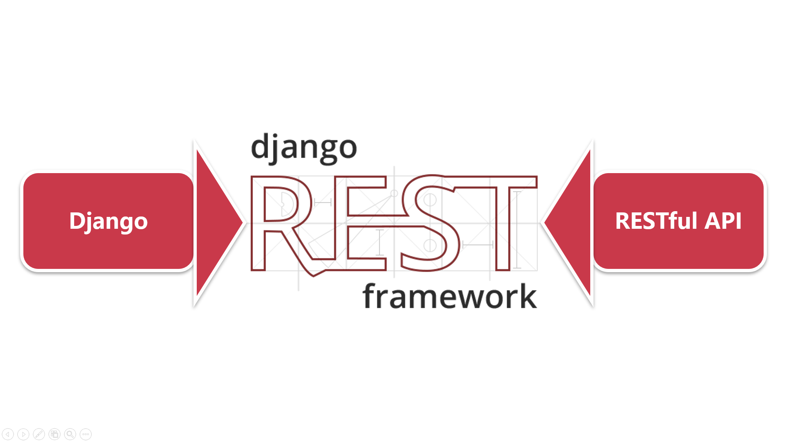
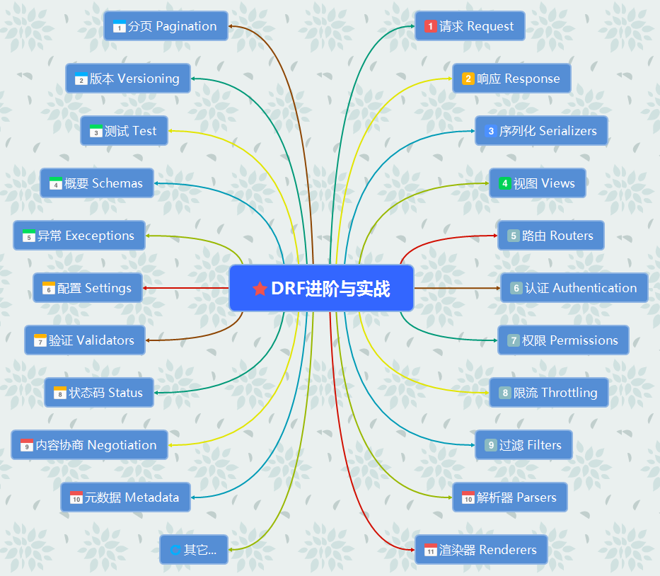

# DRF 框架

::: tip 介绍
- 推荐1：[前往官方文档](https://www.django-rest-framework.org/)

- 推荐2: [bilibili 教程](https://www.bilibili.com/video/BV1Dm4y1c7QQ/)

- 推荐3：[深入理解什么是 Restful 规范](https://www.imooc.com/article/304756)
:::





## Restful API 最佳实践

- 协议
- 域名
- 版本
- 路径
- HTTP动词
- 过滤信息(Filtering)
- 状态码(Status Codes)
- 错误处理(Error handling)
- 返回结果
- Hypermedia API


## HTTP 请求方法详解

- `GET (SELECT)`: 从服务器取出资源(一项或多项)
- `POST (CREATE)`: 在服务器新建一个资源
- `PUT (UPDATE)`: 在服务器更新资源(客户端提供完整资源)
- `PATCH (UPDATE)`: 在服务器更新资源(客户端提供部分资源)
- `DELETE (DELETE)`: 从服务器删除资源
- `HEAD`: 获取资源的元数据
- `OPTIONS`: 获取信息，关于资源的哪些属性是客户端可以改变的


## 创建项目

```bash
$ pip install django djangorestframework        # 安装项目依赖
$ django-admin startproject drf_tutorial        # 创建项目
$ cd drf_tutorial                               # 进入项目目录
$ python manage.py startapp course              # 创建一个课程应用
# 先去修改 `settings.py`, 配置文件完整信息全部在下面: (统一接下来的规范)
$ python manage.py makemigrations               # 生成迁移文件
$ python manage.py migrate                      # 迁移数据
$ python manage.py createsuperuser              # 创建后台超级管理员
$ python manage.py runserver localhost:8000     # 启动数据库
```

- 修改 `settings.py` 配置文件信息如下: 

::: details
::: code-group
```python [settings.py]
"""
Django settings for drf_tutorial project.

Generated by 'django-admin startproject' using Django 5.0.6.

For more information on this file, see
https://docs.djangoproject.com/en/5.0/topics/settings/

For the full list of settings and their values, see
https://docs.djangoproject.com/en/5.0/ref/settings/
"""
import os.path
from pathlib import Path

# Build paths inside the project like this: BASE_DIR / 'subdir'.
BASE_DIR = Path(__file__).resolve().parent.parent


# Quick-start development settings - unsuitable for production
# See https://docs.djangoproject.com/en/5.0/howto/deployment/checklist/

# SECURITY WARNING: keep the secret key used in production secret!
SECRET_KEY = "django-insecure-7m855cg9s1&vk*m7r3emn4_mjvr3yw=ygn+9o2)m*j#jt2&=ph"

# SECURITY WARNING: don't run with debug turned on in production!
DEBUG = True

ALLOWED_HOSTS = ['*']


# Application definition

INSTALLED_APPS = [
    "django.contrib.admin",
    "django.contrib.auth",
    "django.contrib.contenttypes",
    "django.contrib.sessions",
    "django.contrib.messages",
    "django.contrib.staticfiles",
    "rest_framework",  # 添加 rest_framework 框架
    "rest_framework.authtoken",  # 启用 DRF 自带的Token认证, 需要迁移数据, 生成存储 token 的表
    "course",  # 添加应用
]

MIDDLEWARE = [
    "django.middleware.security.SecurityMiddleware",
    "django.contrib.sessions.middleware.SessionMiddleware",
    "django.middleware.common.CommonMiddleware",
    "django.middleware.csrf.CsrfViewMiddleware",
    "django.contrib.auth.middleware.AuthenticationMiddleware",
    "django.contrib.messages.middleware.MessageMiddleware",
    "django.middleware.clickjacking.XFrameOptionsMiddleware",
]

ROOT_URLCONF = "drf_tutorial.urls"

TEMPLATES = [
    {
        "BACKEND": "django.template.backends.django.DjangoTemplates",
        "DIRS": [],
        "APP_DIRS": True,
        "OPTIONS": {
            "context_processors": [
                "django.template.context_processors.debug",
                "django.template.context_processors.request",
                "django.contrib.auth.context_processors.auth",
                "django.contrib.messages.context_processors.messages",
            ],
        },
    },
]

WSGI_APPLICATION = "drf_tutorial.wsgi.application"


# Database
# https://docs.djangoproject.com/en/5.0/ref/settings/#databases

DATABASES = {
    "default": {
        "ENGINE": "django.db.backends.sqlite3",
        "NAME": BASE_DIR / "db.sqlite3",
    }
}


# Password validation
# https://docs.djangoproject.com/en/5.0/ref/settings/#auth-password-validators

AUTH_PASSWORD_VALIDATORS = [
    {
        "NAME": "django.contrib.auth.password_validation.UserAttributeSimilarityValidator",
    },
    {
        "NAME": "django.contrib.auth.password_validation.MinimumLengthValidator",
    },
    {
        "NAME": "django.contrib.auth.password_validation.CommonPasswordValidator",
    },
    {
        "NAME": "django.contrib.auth.password_validation.NumericPasswordValidator",
    },
]


# Internationalization
# https://docs.djangoproject.com/en/5.0/topics/i18n/

LANGUAGE_CODE = "zh-hans"

TIME_ZONE = "Asia/Shanghai"

USE_I18N = True

USE_TZ = True


# Static files (CSS, JavaScript, Images)
# https://docs.djangoproject.com/en/5.0/howto/static-files/

STATIC_URL = "static/"

# Default primary key field type
# https://docs.djangoproject.com/en/5.0/ref/settings/#default-auto-field

DEFAULT_AUTO_FIELD = "django.db.models.BigAutoField"
STATIC_ROOT = BASE_DIR / "static"

STATICFILES_DIRS = [
    os.path.join(BASE_DIR, 'staticfiles'),
]

# DRF的全局配置
REST_FRAMEWORK = {
    # DRF 自带的分页的类
    "DEFAULT_PAGINATION_CLASS": "rest_framework.pagination.PageNumberPagination",
    # 每页显示的个数
    "PAGE_SIZE": 10,
    # 时间显示的格式
    "DATETIME_FORMAT": "%Y-%m-%d %H:%M:%S",     # 年月日 时分秒
    # drf 返回 response 的时候, 使用哪一个 render 类
    "DEFAULT_RENDERER_CLASSES": [
        "rest_framework.renderers.JSONRenderer",
        "rest_framework.renderers.BrowsableAPIRenderer",
    ],
    # 如何解析 Request
    "DEFAULT_PARSER_CLASSES": [
        "rest_framework.parsers.JSONParser",    # 解析 json
        "rest_framework.parsers.FormParser",    # 解析 form
        "rest_framework.parsers.MultiPartParser",   # 解析文件
    ],
    # 权限认证方式
    "DEFAULT_PERMISSION_CLASSES": [
        "rest_framework.permissions.IsAuthenticated",
        # "rest_framework.permissions.IsAdminUser",
    ],
    # 认证方式
    "DEFAULT_AUTHENTICATION_CLASSES": [
        "rest_framework.authentication.BasicAuthentication",    # 用户名密码认证
        "rest_framework.authentication.SessionAuthentication",  # session 认证
        "rest_framework.authentication.TokenAuthentication",    # token 认证, 如果使用 token 认证, 就需要在 app 中启用rest自带的Token认证功能
    ],
}
```

```python [urls.py]
from django.contrib import admin
from django.urls import path, include

urlpatterns = [
    path('api-auth/', include('rest_framework.urls')),  # drf 的登录退出功能
    path("admin/", admin.site.urls),
]
```


:::

> 直接 copy 覆盖自己的配置文件即可


## DRF 组件模块




## 创建模型

::: details
::: code-group

```python [models.py]
from django.db import models
from django.conf import settings

class Course(models.Model):
    name = models.CharField(max_length=255, unique=True, help_text='课程信息', verbose_name='课程信息')
    introduction = models.TextField(help_text='课程介绍', verbose_name='课程介绍')
    teacher = models.ForeignKey(settings.AUTH_USER_MODEL, on_delete=models.CASCADE, help_text='课程讲师',
                                verbose_name='讲师')
    price = models.DecimalField(max_digits=6, decimal_places=2, help_text='课程价格', verbose_name='课程价格')
    create_at = models.DateTimeField(auto_now_add=True, help_text='创建时间', verbose_name='创建时间')
    update_at = models.DateTimeField(auto_now=True, help_text='更新时间', verbose_name='更新时间')

    class Meta:
        verbose_name = '课程信息'
        verbose_name_plural = verbose_name
        ordering = ('price', )

    def __str__(self):
        return self.name
```

```python [admin.py]
from django.contrib import admin
from .models import Course


@admin.register(Course)
class CourseAdmin(admin.ModelAdmin):
    list_display = ('name', 'price', 'introduction', 'teacher')
    search_fields = list_display
    list_filter = list_display
```
:::

> :warning: 执行一下数据库迁移


> 可以在pycharm的控制台通过下面的方式调试模型类

```python
from course.models import Course
from django.core import serializers

serializers.serialize('json', Course.objects.all())     # 获取所有课程信息的序列化结果
```

::: danger :warning:django自带的序列化的不足
1. 验证处理 request.data
2. 验证器的参数
3. 同时序列化多个对象
4. 序列化的过程中添加上下文
5. 无效的数据异常处理

> DRF却包括了以上所有功能
:::


## DRF视图开发RESTful API接口

- 原生django开发视图

```python
# views.py

import json

from django.http import HttpResponse, JsonResponse
from django.utils.decorators import method_decorator
from django.views import View
from django.views.decorators.csrf import csrf_exempt

course_dict = {
    'name': '课程名称',
    'introduction': '课程介绍',
    'price': 11.1
}


# Django原生的 FBV 编写API接口
@csrf_exempt
def course_list(request):
    if request.method == 'GET':
        # return HttpResponse(json.dumps(course_dict, content_type='application/json'))
        return JsonResponse(course_dict)  # 两者等价

    if request.method == 'POST':
        course = json.loads(request.body.decode('utf-8'))
        # return JsonResponse(course, safe=False)
        return HttpResponse(json.dumps(course, content_type='application/json'))


# Django CBV 编写API接口
@method_decorator(csrf_exempt, name='dispatch')
class CourseList(View):
    def get(self, request):
        return JsonResponse(course_dict)

    @csrf_exempt
    def post(self, request):
        course = json.loads(request.body.decode('utf-8'))
        return HttpResponse(json.dumps(course), content_type='application/json')

# 分页、排序、认证、权限、限流等等

```


### 函数式编程 Function Based View


### 类视图 Classed Based View


### 通用类视图 Generic Classed Based View


### DRF的视图集 viewsets


